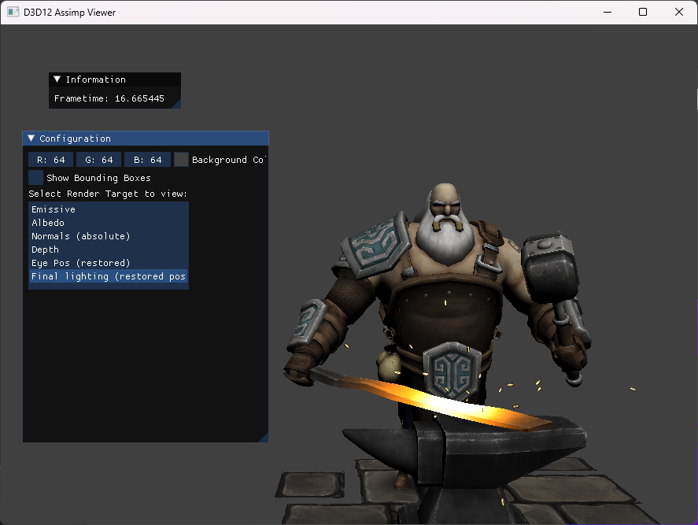
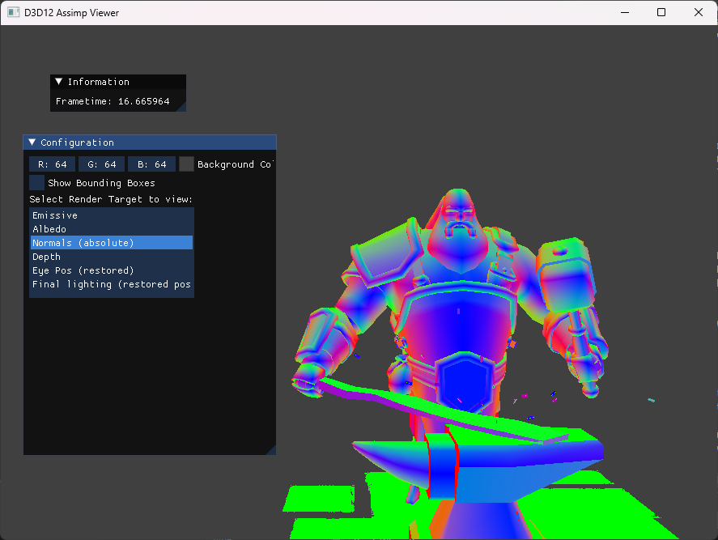
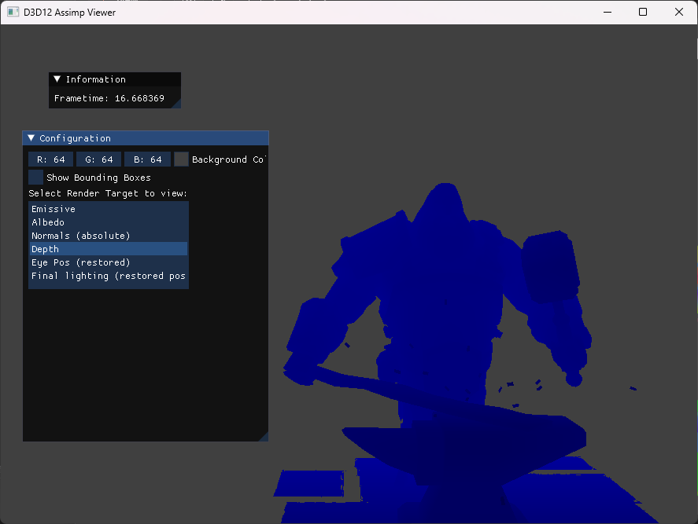
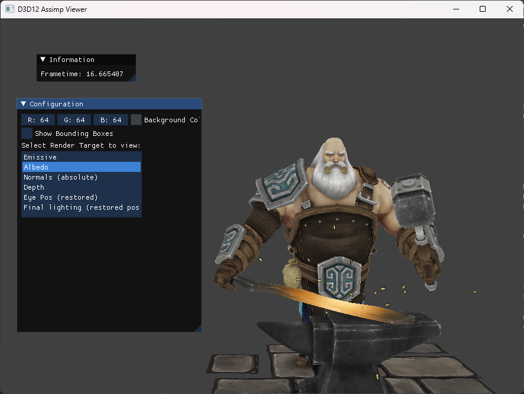
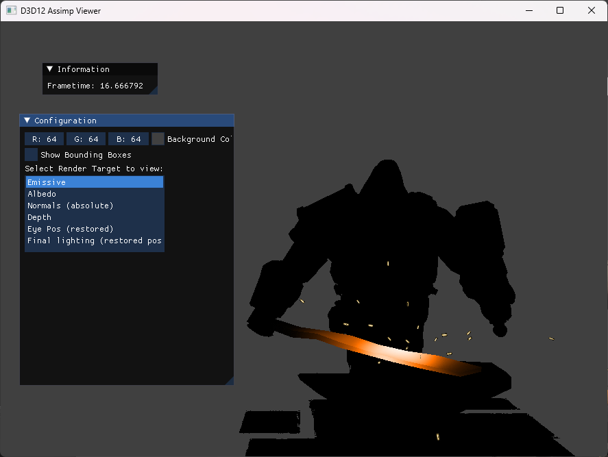
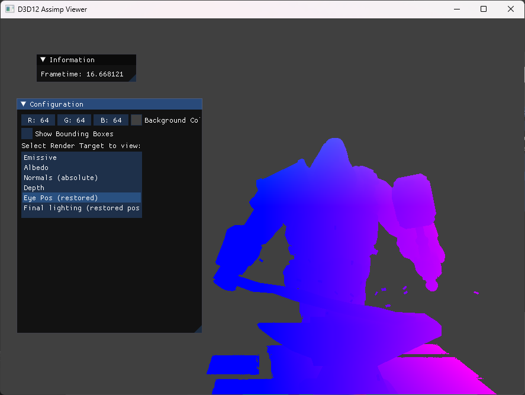

# DirectX 3D 12 Rendering Engine

This project is the result of the "GPU Image Synthesis" course I took in the summer 2023.
The goal was the creation of a rendering engine using D3D12.

The main engine was a guided step-by-step tutorial by the professor. The imgui UI and framework was provided by him.
After that, smaller groups of students worked on implementing different features (post-processing effects, shadow mapping, mesh shaders, etc.)
My responsibility was [deferred rendering](https://github.com/OutOfCache/D3D12RenderingEngine/tree/deferred).
## Deferred Rendering

The G-Buffer writes out the normals and depth, as well as the albedo and emissive values. 
The positions are restored from the depth buffer, as described in [this wiki article](https://www.khronos.org/opengl/wiki/Compute_eye_space_from_window_space#From_XYZ_of_gl_FragCoord).
A compute shader takes these render targets as inputs and computes the final lighting. It writes to an output UAV (which is also the emissive RTV, so we overwrite the values instead of creating a new one).

This is the final result:

The UI enables the selection of the render targets to view:

### Normals
Displayed as absolute values, so negative values are not black. For the lighting calculation, we use the original, unaltered values.

### Depth

### Albedo

### Emissive

### Eye position

### Future work
- eliminate one element of the normals. Since `n.z = 1 - n.x - n.y`, we only need to write `n.x` and `.n.y` out.
- add specular information
- optimize eye position reconstruction as shown [here](https://www.khronos.org/opengl/wiki/Compute_eye_space_from_window_space#Optimized_method_from_XYZ_of_gl_FragCoord)

